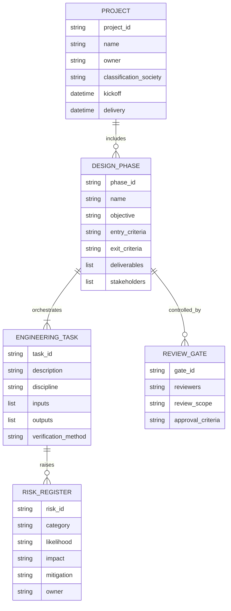

# Ship Design Architecture

이 디렉터리는 선박 설계 프로세스를 구조화하고, 데이터 스키마와 워크플로우를 시각화하며, LangChain을 활용한 LLM 기반 자동화 예시를 제공합니다.

## 데이터 스키마

아래 모델은 선박 설계 프로젝트를 구성하는 주요 엔티티와 관계를 설명합니다. `ship_design_schema.py`에 정의된 Pydantic 모델과 1:1로 매핑되며, 요구사항 수집에서 상세 설계까지 단계별 산출물과 검증 포인트를 다룹니다.



## 워크플로우

다음 Mermaid 시퀀스는 선박 설계 프로젝트에서 정보가 흐르는 방식과 LLM이 각 단계의 의사결정, 보고, 리스크 추적에 관여하는 지점을 보여줍니다.

```mermaid
flowchart TD
    A[요구사항 수집 및 해석\n(LLM: 이해관계자 질의 요약)] --> B[개념 설계\n(LLM: 선형/추진 대안 설명)]
    B --> C[기본 설계\n(LLM: 규정 준수 체크리스트 생성)]
    C --> D[상세 설계\n(LLM: 부재별 제조 설명 자동화)]
    D --> E[검증 및 검토 게이트\n(LLM: 리뷰 보고서 초안)]
    E --> F[선급/선주 승인\n(LLM: Q&A 대응 초안)]
    F --> G[생산 준비 데이터 패키지\n(LLM: BOM/도면 설명서 정리)]
    D --> H[리스크 등록부 업데이트\n(LLM: 리스크/완화 전략 생성)]
    H --> E
```

## LangChain 예시

- `langchain_ship_design_example.py`는 위 데이터 모델을 바탕으로 LLM에게 단계별 설계 보고서를 생성하도록 지시하는 체인을 구성합니다.
- 모든 커뮤니케이션은 `langchain_openai.ChatOpenAI`를 통해 LLM에 위임하며, 산출물은 `ShipDesignReport` 모델로 구조화됩니다.
- 실행 전 `OPENAI_API_KEY` 또는 호환 가능한 API 키를 환경 변수로 설정하십시오.

```bash
pip install "cadai[architecture]"
python -m architecture.langchain_ship_design_example --project-id SDX-001
```

스크립트는 각 설계 단계의 목표, 입력 조건, 산출물을 요약한 보고서를 생성하고, 리스크와 검토 게이트에 대한 LLM 응답도 포함합니다.
