# CAD Sequence Toolcalling: Specification & Execution Plan

## 1. 목표와 배경
- **최상위 목표**: FreeCAD 없이도 Text2CAD에서 사용한 `CADSequence` 표현을 그대로 생성·편집·파라메트릭 제어할 수 있는 Toolcalling 생태계를 구축하고, PythonOCC만으로 STL/STEP을 출력한다.
- **2단계 전략**
  1. **Hull 전용 에이전트(Hull Agent)**  
     - Stations/Waterlines/Buttocks 정의 → NURBS Loft → Fairness 체크 → shell mesh/STEP 출력  
     - CFD/선형해석, 생산 설계용 외판 데이터를 담당.
  2. **범용 피처 에이전트(Structure Agent)**  
     - 본 문서의 Sketch+Extrude 파라메트릭 도구 세트로 선체 외 구조(상부 구조, 내부 구조물, 장비 기초 등)를 생성.
- **핵심 지향점 (Structure Agent 기준)**
  - Sketch → Extrude 기반 피처 모델링
  - 파라미터(치수) 정의/업데이트로 재생성 가능한 워크플로
  - LLM이 호출할 Tool API를 명확히 규격화
  - 세션/상태 관리, 에러 리포트, 검증 루틴 포함
- **선행 자료**: `docs/CAD_SEQUENCE_TOOLCALLING.md`에서 제안된 아이디어와 파라메트릭 관리 개념 (예: define/update parameter, `_resolve_parameter()` 로직 등).

### 1.1 아키텍처 다이어그램

```mermaid
flowchart TD
    U[사용자/LLM 요청] --> R[플랜/Router]
    R -->|Hull 관련 지시| HA[Hull Agent]
    R -->|구조/피처 지시| SA[Structure Agent]
    HA --> HTools[Hull Toolset<br/>Stations · Loft · Fairness · CFD]
    HTools -->|Shell Mesh/STEP| HOut[Hull Outputs]
    SA --> STools[Structure Toolset<br/>Sketch · Extrude · Parametric]
    STools -->|CADSequence · STL/STEP| SOut[Structure Outputs]
    HOut -->|공유 데이터| Integr[통합 데이터 스토어]
    SOut --> Integr
    Integr --> Downstream[생산/해석 파이프라인]
```


## 2. 기능 스펙

### 2.1 세션 및 상태
| 항목 | 설명 |
| --- | --- |
| Session Builder | `CADSequenceBuilder` 인스턴스. 세션 ID로 매핑하여 동시 사용자 분리. |
| 저장 데이터 | `current_sketch_curves`, `sketch_seq`, `extrude_seq`, `parameters`, `parameter_references`, `current_plane`. |
| 수명 주기 | `new_session` 호출 → 일련의 tool 호출 → `finalize_cad_model` 또는 `reset_session`. |

### 2.2 Tool API
#### Sketch Tools
| 이름 | 필수 파라미터 | 비고 |
| --- | --- | --- |
| `create_sketch_circle` | `center_x`, `center_y`, `radius` (number or parameter name) | `parameter_name` 선택 입력, 좌표 정규화 검증 |
| `create_sketch_line` | `start_x`, `start_y`, `end_x`, `end_y` | 파라미터 참조 가능, 길이 파라미터 연결 |
| `create_sketch_arc` | `center_x`, `center_y`, `radius`, `start_angle`, `end_angle` | 정규화·각도 검증 |
| `new_sketch` | `plane`(default `xy`) | 스케치 곡선 버퍼 초기화 |

#### Extrude & Boolean
- `add_extrude(distance, boolean_operation, distance_reverse=0)`  
  - distance 값은 정규화 실수 or 파라미터 이름  
  - boolean_operation ∈ {`new_body`, `join`, `cut`, `intersect`}  
  - 실행 시 현재 스케치 → Face/Loop → `SketchSequence` 생성 후 `ExtrudeSequence` append

#### Parametric Tools
| 이름 | 설명 |
| --- | --- |
| `define_parameter(name, value, unit="mm", description?, min_value?, max_value?)` |
| `update_parameter(name, value)` – 참조된 곡선/익스트루드 값을 즉시 갱신 |
| `get_parameters()` – 현재 파라미터 목록 |
| `delete_parameter(name)` – 참조 제거 및 관련 요소 초기화(or 에러) |

#### 기타
- `get_cad_info()` – 스케치/익스트루드/파라미터 개수, 현재 평면, 미완성 곡선 등 리포트
- `finalize_cad_model(output_format, output_path)` – STL/STEP 생성, 결과 경로 반환
- `reset_session()` – 세션 상태 초기화

### 2.3 파라미터 처리 규칙
1. **저장 포맷**: `{ value: float, unit: str, description, min_value, max_value }`.
2. **정규화**: 내부 좌표는 0–1, 외부 단위(mm 등)는 `normalization_base` 로 나눠 사용. Extrude 거리도 동일 스케일 사용.
3. **참조 테이블**: `parameter_references[name] = [{type, sketch_index, curve_index, field}]`.
4. **업데이트 흐름**:
   - `update_parameter` 호출 → `_normalize_value()` → 해당 곡선/익스트루드 property 갱신 → `cad_seq` dirty flag 설정.
   - 필요 시 `finalize_cad_model`이 최신 상태인지 검사.

## 3. 기술 설계

### 3.1 모듈 구조
```
src/
  cadseq_tools/
    builder.py          # CADSequenceBuilder + 파라미터 로직
    tool_handlers.py    # MCP/LiteLLM와 연결되는 async handler
  mcp_server/
    cadseq_server.py    # FastMCP 정의, tool schema 제공
  agent/
    cadseq_agent.py     # ToolCallingAgent variant
```

### 3.2 오류 처리 전략
- 입력 검증 실패 시 `{success: False, error_code, message}` 반환.
- 파라미터 미존재, 범위 위반, 미완성 스케치 등 상황별 코드를 정의.
- `get_cad_info()` 사용을 장려하기 위해 LLM 가이드에 실패시 호출 예시 포함.

### 3.3 테스트 항목
1. 단일 세션에서 링/박스/원기둥 생성 시나리오.
2. 파라미터 업데이트 후 STL/STEP 모두 재생성되는지.
3. 동시 세션 2개 이상의 상태 격리.
4. 비정상 입력(음수 반지름 등)의 에러 메시지 일관성.

## 4. 실행 계획

| 단계 | 기간 | 주요 작업 |
| --- | --- | --- |
| **Phase 0 – 공통 Infra** | 0.5d | MCP 서버 뼈대, 세션 dictionary, 테스트 harness (Structure/Hull 공용) |
| **Phase 1 – Structure Agent v1** | 1d | Circle/Line/Arc + Extrude + finalize, FreeCAD 종속 제거, STL/STEP 확인 |
| **Phase 2 – 파라메트릭 계층** | 1.5d | 파라미터 CRUD, `_resolve_parameter`, 참조 업데이트, 단위 변환 |
| **Phase 3 – Hull Agent PoC** | 1d | Station 정의, NURBS loft, fairness metric, shell mesh 내보내기 |
| **Phase 4 – Agent & Prompting** | 0.5d | 각 에이전트 System Prompt, 예제 시나리오, 가드레일 |
| **Phase 5 – 테스트 & 문서화** | 0.5d | Structure/Hull 통합 시나리오 테스트, 문서 업데이트 |

총 예상: **~4.5일** (엔지니어 1명 기준). Hull Agent는 초기 PoC 수준으로 정의하고, 확장 항목은 아래 “추가 CAD/조선 Agent 아이디어”에서 관리.

## 5. 추가 CAD/조선 Agent 아이디어

| 에이전트 | 역할 | 핵심 기능 |
| --- | --- | --- |
| **Hull Agent** | 외판/선형 설계 | Station/Waterline, NURBS loft, fairing, shell mesh, CFD export |
| **Structure Agent** | 내부 구조·상부 구조 | Sketch+Extrude, 파라메트릭 피처, CADSequence 기반 (본 문서 대상) |
| **Outfitting Agent** | 배관/케이블 트레이/장비 배치 | Path routing, 최소 굴곡 반경, 노즐 연결 포인트, BOM 생성 |
| **Piping Agent (세분화)** | 배관망 전용 | 이음새 규칙, 표준 파이프 스펙, 등가 길이 계산 |
| **Electrical/Instrumentation Agent** | 케이블, 센서 | 케이블 트레이 설계, 센서 위치, IO 리스트 |
| **Production Prep Agent** | 패널 전개/재단 | 외판 패널 펼침, 절단 계획, 용접 시퀀스 |
| **Analysis Agent** | CFD/저항/복원성 | Hull Agent가 만든 메쉬를 이용해 해석 소프트웨어 입력 구성 |

추가 에이전트는 Hull/Structure 파이프라인과 데이터 교환(예: 공통 STEP, CADSequence export)을 염두에 두고 설계한다.

## 6. 추가 고려사항
- **LLM 가이드**: 예제 프롬프트와 허용되는 단계(예: “각 스케치마다 `new_sketch` 호출”)를 system message에 포함.
- **버전 관리**: CADSequenceBuilder 버전을 상태에 저장해 향후 포맷 변경 시 마이그레이션 가능.
- **보안/안정성**: Tool 호출에 파일 경로 제한(작업 디렉토리 하위), 출력 덮어쓰기 확인.

---
본 문서는 `docs/CAD_SEQUENCE_TOOLCALLING.md`의 구상안을 정식 스펙·로드맵으로 정리한 것으로, 구현 전에 합의용 기준 문서로 사용한다.
